# CareerMind AI

> An AI-powered career intelligence platform that helps students analyze their resumes, understand job requirements, identify skill gaps, build personalized learning roadmaps, and practice interviews with AI-powered feedback.

## 🚀 Overview

CareerMind AI is a full-stack career preparation platform designed to help students prepare for software and technology roles.

Instead of using separate tools for resume analysis, job analysis, skill-gap identification, learning plans, and interview practice, CareerMind AI brings these capabilities together into one platform.

### Core Workflow

**Resume → Job Description → Skill Analysis → Skill Gap → Learning Roadmap → AI Interview → Performance Analytics → Career Readiness**

---

## ✨ Features

### 📄 CV Intelligence

* Upload a resume in PDF format.
* Extract candidate information and technical skills.
* Identify technologies, programming languages, frameworks, and development tools.
* Store resume information in MySQL.

### 💼 Job Intelligence

* Enter a target job description.
* Automatically extract relevant technical skills.
* Store job requirements for analysis.

### 📊 Skill Gap Analysis

* Compare resume skills with job requirements.
* Identify matched skills.
* Identify missing skills.
* Calculate a skill match percentage.

### 🗺️ Personalized Career Roadmap

* Generate a learning roadmap based on missing skills.
* Provide recommended topics.
* Suggest practical projects for each skill.
* Organize learning into manageable steps.

### 🎤 AI Interview Room

* Generate interview questions for the selected role.
* Answer questions directly through the platform.
* Evaluate answers using a locally running AI model.
* Provide structured feedback and a score.

### 📈 Interview Progress Analytics

* Track total interviews.
* Calculate average interview score.
* Display best and latest scores.
* Visualize interview performance.
* Identify performance trends.

### 🧠 Interview History

* Store previous interview attempts.
* View questions, answers, scores, and AI feedback.
* Filter interview history by question type and score.

### 🎯 Career Readiness

* Combine skill-match and interview performance.
* Display an overall career-readiness score.
* Provide preparation feedback based on current performance.

---

## 🏗️ System Architecture

```text
                         ┌──────────────────────┐
                         │      User            │
                         │ Resume + Job +       │
                         │ Interview Answers    │
                         └──────────┬───────────┘
                                    │
                                    ▼
                         ┌──────────────────────┐
                         │   HTML / CSS / JS    │
                         │    Web Dashboard     │
                         └──────────┬───────────┘
                                    │ REST APIs
                                    ▼
                    ┌──────────────────────────────┐
                    │       Spring Boot Backend    │
                    │                              │
                    │ Resume Intelligence          │
                    │ Job Intelligence             │
                    │ Skill Gap Analysis           │
                    │ Career Roadmap               │
                    │ Interview Management         │
                    │ Career Readiness             │
                    └─────────────┬────────────────┘
                                  │
                    ┌─────────────┴─────────────┐
                    ▼                           ▼
          ┌──────────────────┐        ┌──────────────────┐
          │      MySQL       │        │      Ollama      │
          │                  │        │   Local LLM      │
          │ Resume data      │        │                  │
          │ Job data         │        │ AI Interview     │
          │ Interview data   │        │ Evaluation       │
          └──────────────────┘        └──────────────────┘
```

---

## 🛠️ Technology Stack

### Frontend

* HTML5
* CSS3
* JavaScript

### Backend

* Java
* Spring Boot
* Spring Data JPA
* REST APIs

### Database

* MySQL

### AI

* Ollama
* Llama 3.2 3B

### Document Processing

* Apache PDFBox

### Development Tools

* IntelliJ IDEA
* Maven
* Git
* GitHub

---

## 🤖 AI Interview Evaluation

CareerMind AI uses a locally running Llama 3.2 model through Ollama for interview-answer evaluation.

The evaluation considers:

* Relevance
* Technical Accuracy
* Clarity and Structure
* Specific Examples
* Communication and Professionalism

The system produces:

* Question Type
* Category-wise evaluation
* Overall Score
* Strengths
* Improvements
* Better Answer

The AI evaluation runs locally through Ollama, avoiding dependency on paid cloud AI APIs.

---

## 🔌 REST API Modules

### Health

```text
GET /api/health
```

### Resume

```text
POST /api/resumes
GET  /api/resumes
POST /api/resumes/upload
```

### Job Description

```text
POST /api/jobs
GET  /api/jobs
```

### Skill Gap

```text
GET /api/skill-gap/analyze
```

### Career Roadmap

```text
GET /api/roadmap/generate
```

### Interviews

```text
GET  /api/interviews
POST /api/interviews
GET  /api/interviews/questions
POST /api/interviews/ai-evaluate
```

---

## 🗄️ Database Structure

CareerMind AI currently uses MySQL to persist:

* Resume information
* Job descriptions
* Required skills
* Interview questions
* Interview answers
* AI feedback
* Interview scores

The backend uses Spring Data JPA and Hibernate for database interaction.

---

## 🔄 Example User Journey

### Step 1 — Upload Resume

The user uploads a PDF resume.

CareerMind AI extracts:

```text
Name
Email
Phone
Technical Skills
```

### Step 2 — Add Job Description

The user enters a target job description.

The system extracts the required skills.

### Step 3 — Analyze Skill Gap

The platform compares:

```text
Resume Skills
       ↓
Required Job Skills
       ↓
Matched Skills + Missing Skills
       ↓
Skill Match Percentage
```

### Step 4 — Generate Roadmap

Missing skills are converted into a personalized learning roadmap.

### Step 5 — Practice Interview

CareerMind AI generates interview questions based on the selected role.

### Step 6 — AI Evaluation

The user's answer is evaluated using the local Llama model.

### Step 7 — Track Progress

Interview scores are stored and displayed through analytics.

### Step 8 — Career Readiness

The platform combines skill and interview performance to provide an overall preparation indicator.

---

## 📸 Screenshots

### 🏠 Dashboard

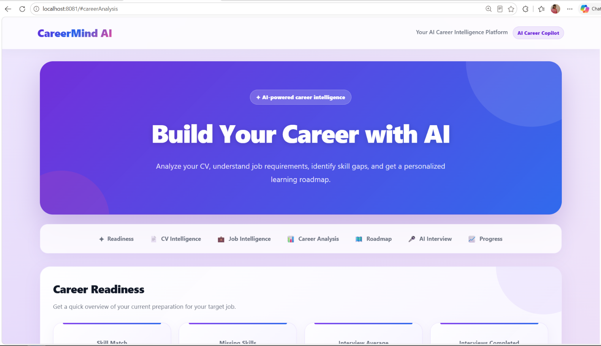

### 📄 CV Intelligence

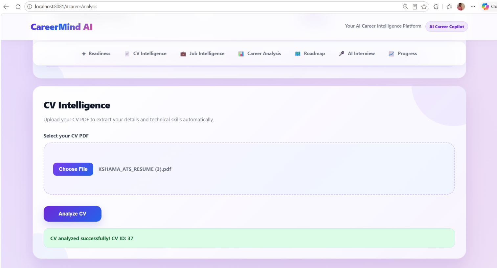

### 🎯 Career Readiness

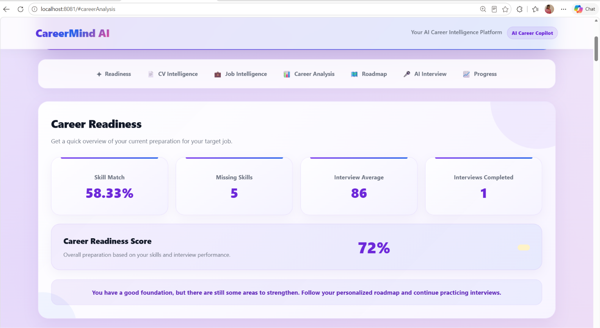

### 💼 Job Intelligence

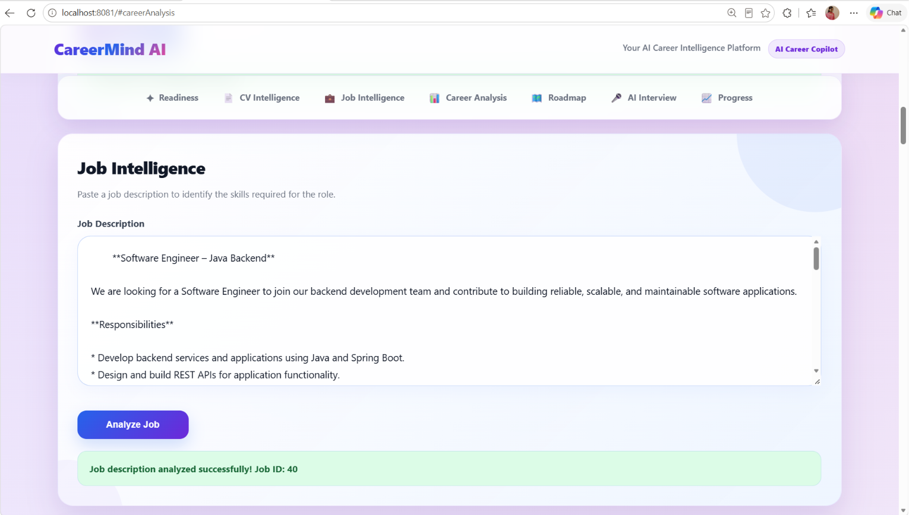

### 📊 Skill Gap Analysis

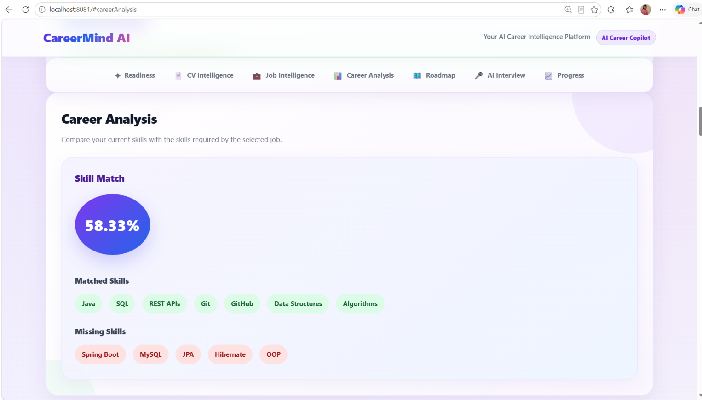

### 🗺️ Career Roadmap

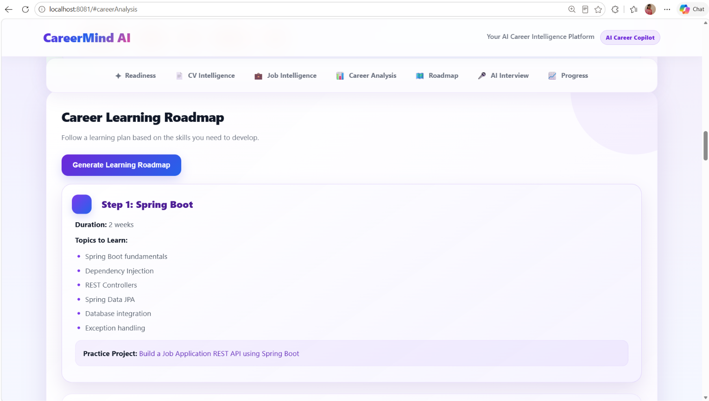

### 🎤 AI Interview Questions

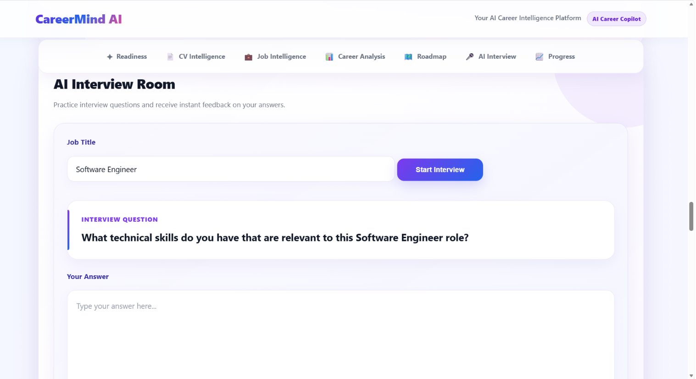

### 💬 AI Interview Answer

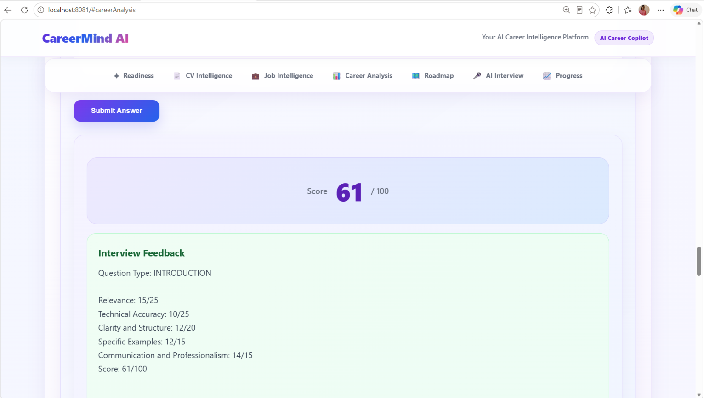

### 📚 Interview History

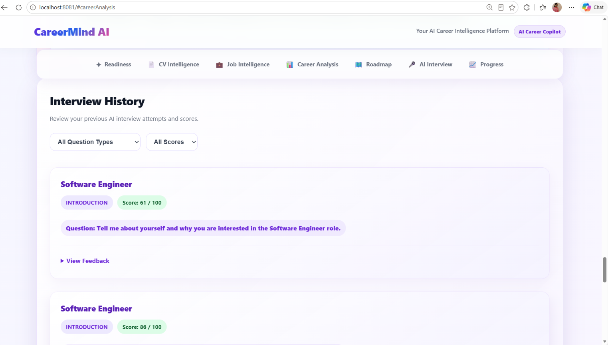

### 📈 Interview Progress

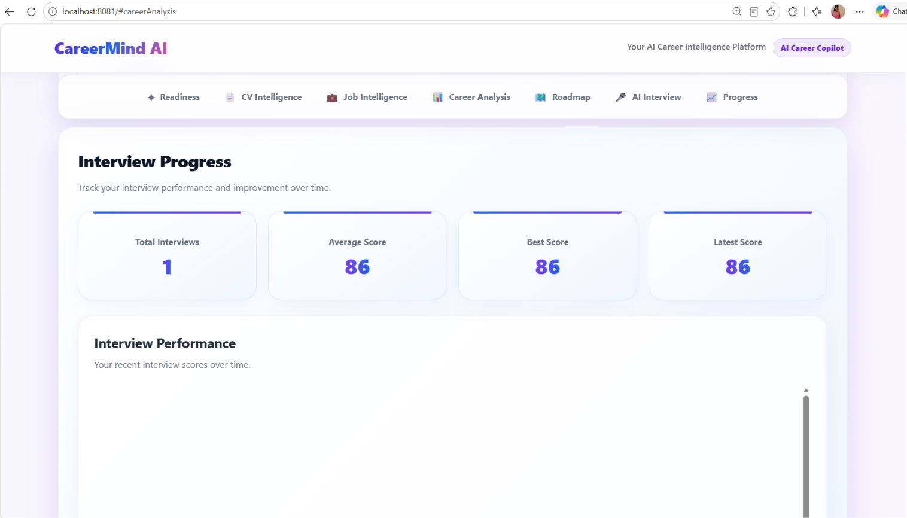

### 🚀 Project Overview

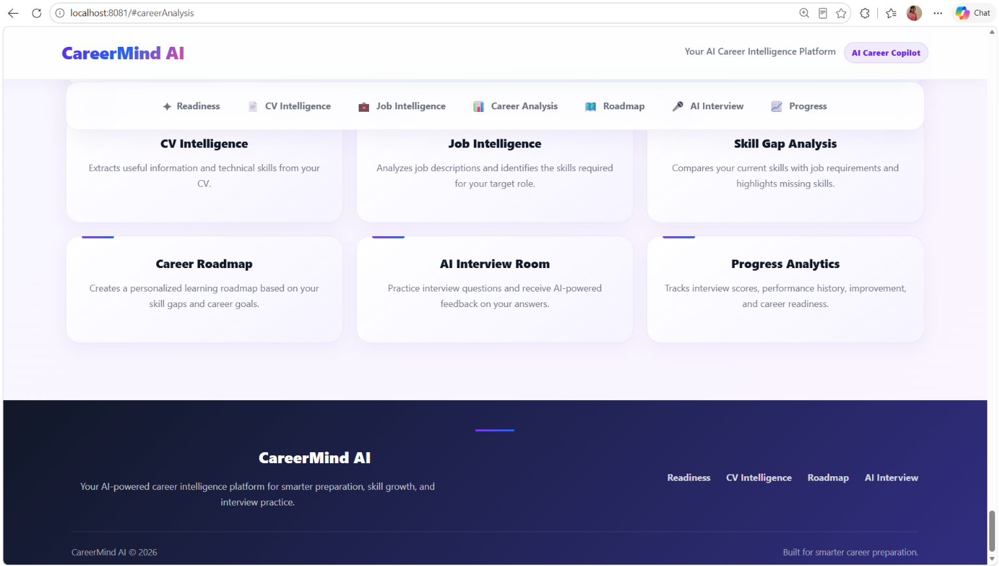
---

## ▶️ Running the Project Locally

### Prerequisites

Install:

* Java 21
* Maven
* MySQL
* Ollama

### 1. Clone the repository

```bash
git clone https://github.com/kshamagowda/CareerMind-AI.git
cd CareerMind-AI
```

### 2. Configure MySQL

Create the database:

```sql
CREATE DATABASE careermind;
```

Update the database credentials in:

```text
src/main/resources/application.properties
```

Example:

```properties
spring.datasource.url=jdbc:mysql://localhost:3306/careermind
spring.datasource.username=root
spring.datasource.password=YOUR_MYSQL_PASSWORD

spring.jpa.hibernate.ddl-auto=update

server.port=8081
```

### 3. Install Ollama

Install Ollama and download the model:

```bash
ollama pull llama3.2:3b
```

Start Ollama before using the AI interview evaluation feature.

### 4. Run the application

Using Maven:

```bash
mvn spring-boot:run
```

Or run the Spring Boot application from IntelliJ IDEA.

### 5. Open the application

```text
http://localhost:8081
```

---

## 📁 Project Structure

```text
CareerMind-AI/
│
├── src/
│   └── main/
│       ├── java/
│       │   └── com/careermind/careermind/
│       │       ├── controller/
│       │       ├── model/
│       │       ├── repository/
│       │       └── service/
│       │
│       └── resources/
│           ├── static/
│           │   └── index.html
│           └── application.properties
│
├── pom.xml
└── README.md
```

---

## 🔐 Privacy and Local AI

CareerMind AI uses a locally running AI model through Ollama for interview evaluation.

This allows the AI evaluation component to operate without requiring a paid external AI API.

> Do not commit database passwords, API keys, or other secrets to the repository.

---

## 🚀 Future Enhancements

Planned improvements include:

* User authentication and profiles
* Multiple resume management
* Multiple job applications
* Resume-to-job history
* More personalized AI-generated interview questions
* Interview question difficulty levels
* Skill progress tracking
* Advanced career analytics
* Resume improvement suggestions
* Job recommendation system
* Cloud deployment
* Production database configuration

---

## 🎯 Project Goal

CareerMind AI aims to provide students with a single platform for understanding their career readiness and preparing for technology roles through a combination of:

**Resume Intelligence + Job Intelligence + Skill Analysis + Personalized Learning + AI Interview Practice + Performance Analytics**

---

## 👩‍💻 Author

**Kshamadharithri H P**

Information Science and Engineering
AMC Engineering College, Bengaluru

GitHub:
https://github.com/kshamagowda/Kshama

LinkedIn:
https://www.linkedin.com/in/kshamadharithri-h-p-ab2165329

---

## ⭐ Project

If you find CareerMind AI useful, consider giving the repository a star.
