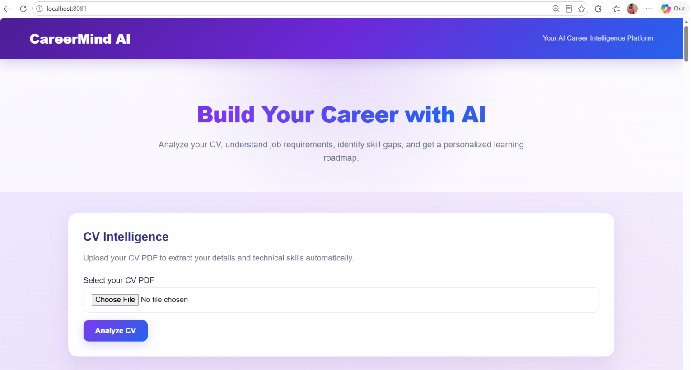

# CareerMind AI

**AI-powered career intelligence and placement copilot for students.**

CareerMind AI helps students understand their career readiness by analyzing résumés and job descriptions, identifying skill gaps, generating personalized learning roadmaps, and providing an AI-powered interview practice environment.

---

## 🚀 Features

### 📄 Résumé Intelligence

* Upload a PDF résumé
* Extract résumé text automatically
* Detect technical skills from the résumé
* Store extracted résumé information in MySQL

### 💼 Job Intelligence

* Add job descriptions
* Automatically identify required technical skills
* Store job descriptions and extracted skills
* Compare job requirements with candidate skills

### 📊 Skill Gap Analysis

CareerMind AI compares the skills found in a résumé with the skills required by a job.

It provides:

* Skill match percentage
* Matched skills
* Missing skills

### 🗺️ Personalized Learning Roadmap

Based on missing skills, CareerMind AI generates a learning roadmap containing:

* Learning duration
* Topics to study
* Practice projects
* Step-by-step learning progression

### 🎤 AI Interview Room

Practice interview questions for a selected role.

The system:

* Generates role-specific interview questions
* Accepts candidate answers
* Evaluates answers using AI
* Provides a score out of 100
* Provides strengths and improvement suggestions
* Generates a better-answer example
* Automatically moves to the next question

### 📚 Interview History

Previous interview attempts are stored in the database.

Students can review:

* Job title
* Interview question
* Score
* AI feedback
* Previous answers

### 📈 Interview Progress Analytics

CareerMind AI provides interview performance analytics:

* Total interviews
* Average score
* Best score
* Latest score

---

## 🧠 AI Integration

CareerMind AI uses **Ollama** for local AI-powered interview evaluation.

Current model:

```text
llama3.2:3b
```

The AI evaluates interview answers across multiple dimensions:

* Relevance
* Technical Accuracy
* Clarity and Structure
* Specific Examples and Personal Contribution
* Communication and Professionalism

The evaluation is adapted according to the type of interview question.

---

## 🛠️ Technology Stack

### Frontend

* HTML5
* CSS3
* JavaScript

### Backend

* Java 21
* Spring Boot
* Spring Data JPA
* REST APIs
* Maven

### Database

* MySQL
* Hibernate / JPA

### AI

* Ollama
* Llama 3.2 3B

### Development Tools

* IntelliJ IDEA
* Git
* GitHub

---

## 🏗️ Application Flow

```text
                 CareerMind AI
                       │
        ┌──────────────┼──────────────┐
        │              │              │
     Résumé           Job          Interview
     Analysis       Analysis          Room
        │              │              │
        └──────────────┼──────────────┘
                       │
                 Skill Analysis
                       │
                 Skill Gap Analysis
                       │
             Personalized Roadmap
                       │
              Interview Practice
                       │
             Progress Analytics
```

---

## 🔌 REST API Modules

### Résumé APIs

```text
POST /api/resumes
GET  /api/resumes
POST /api/resumes/upload
```

### Job APIs

```text
POST /api/jobs
GET  /api/jobs
```

### Skill Gap API

```text
GET /api/skill-gap/analyze
```

### Roadmap API

```text
GET /api/roadmap/generate
```

### Interview APIs

```text
POST /api/interviews
GET  /api/interviews
GET  /api/interviews/questions
POST /api/interviews/ai-evaluate
```

### Health Check

```text
GET /api/health
```

---

## 🗄️ Database

CareerMind AI uses MySQL to persist application data.

The current application stores information related to:

* Résumés
* Job descriptions
* Interview attempts
* Interview answers
* AI feedback
* Interview scores

Hibernate automatically manages the required database schema using the configured JPA settings.

---

## ▶️ How to Run

### 1. Clone the repository

```bash
git clone https://github.com/kshamagowda/CareerMind-AI.git
```

### 2. Open the project

Open the project in IntelliJ IDEA.

### 3. Configure MySQL

Create a database named:

```text
careermind
```

Update the database credentials in:

```text
src/main/resources/application.properties
```

Example:

```properties
spring.datasource.url=jdbc:mysql://localhost:3306/careermind
spring.datasource.username=root
spring.datasource.password=YOUR_MYSQL_PASSWORD

spring.jpa.hibernate.ddl-auto=update
spring.jpa.show-sql=true
spring.jpa.database-platform=org.hibernate.dialect.MySQLDialect

server.port=8081
```

### 4. Start Ollama

Make sure Ollama is installed and the required model is available:

```bash
ollama run llama3.2:3b
```

### 5. Run the Spring Boot application

Run the main Spring Boot application from IntelliJ IDEA.

The application runs on:

```text
http://localhost:8081
```

---

## 📁 Project Structure

```text
CareerMind-AI/
│
├── src/
│   └── main/
│       ├── java/
│       │   └── com/careermind/careermind/
│       │       ├── controller/
│       │       ├── model/
│       │       ├── repository/
│       │       └── service/
│       │
│       └── resources/
│           ├── static/
│           │   └── index.html
│           └── application.properties
│
├── screenshots/
│   └── homepage.png
│
├── pom.xml
├── Maven Wrapper
├── README.md
└── .gitignore
```

---

## 📸 Screenshots

### CareerMind AI Dashboard



---

## 🎯 Project Goal

CareerMind AI is designed to make career preparation more structured for students.

Instead of using separate tools for résumé analysis, job analysis, skill-gap identification, learning planning, and interview practice, the project brings these workflows together into a single career preparation platform.

---

## 🔮 Future Improvements

Planned improvements include:

* More advanced résumé intelligence
* Improved job-role matching
* Expanded skill database
* More personalized learning recommendations
* Additional interview question categories
* More detailed interview analytics
* Authentication and user profiles
* Deployment as a cloud-based application

---

## 👩‍💻 Author

**Kshamadharithri H P**

Information Science and Engineering
AMC Engineering College, Bengaluru

GitHub:
https://github.com/kshamagowda/Kshama

LinkedIn:
https://www.linkedin.com/in/kshamadharithri-h-p-ab2165329/
